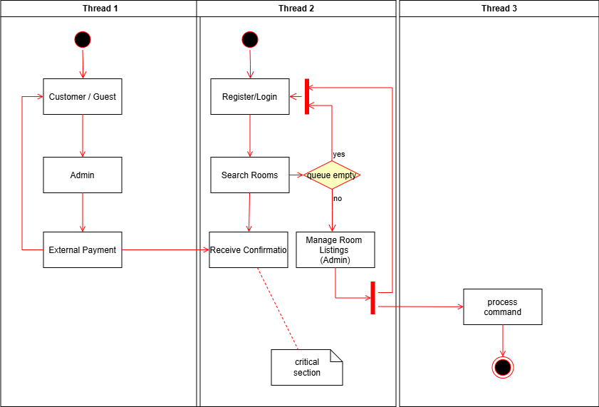

# requirement-analysis
##Requirement Analysis in Software Development.
# 📘 Introduction

Welcome to the **Requirement Analysis in Software Development** repository.  
This project serves as a foundational blueprint for understanding and applying requirement analysis techniques within the software development lifecycle (SDLC). It includes comprehensive documentation, use case diagrams, and real-world examples related to a booking management system.

Whether you're a developer, stakeholder, or curious learner, this repository provides clear insights into how structured analysis leads to better software planning, execution, and delivery.
### What is Requirement Analysis?

Requirement Analysis is the foundational phase in the Software Development Life Cycle (SDLC) where the needs, expectations, and constraints of stakeholders are identified, documented, and analyzed to define what the software system must achieve. It acts as the blueprint for the entire development process, ensuring that the final product aligns with business goals and user expectations.

### This process involves:

🧠 Understanding what the client or end-user wants

📝 Translating those needs into clear, actionable software requirements

🔍 Analyzing feasibility, scope, and constraints

📄 Documenting everything in a structured format for developers, testers, and stakeholders

## Why is Requirement Analysis Important?

# Requirement Analysis is not just a step — it’s the cornerstone of successful software development. Here's why:

1. Clarity and Alignment
It ensures that all stakeholders — from clients to developers — have a shared understanding of what the software should do.

Prevents miscommunication and scope creep by defining clear boundaries and expectations early on.

2. Reduces Costly Mistakes
Errors discovered during development or after deployment are far more expensive to fix than those caught during the analysis phase.

A well-documented requirement set minimizes rework and delays.

3. Improves Planning and Estimation
With clearly defined requirements, teams can better estimate timelines, resources, and budgets.

It enables accurate project scoping and risk assessment

### Activities in Requirement Analysis
### Requirement Gathering

- Involves collecting raw requirements from stakeholders, clients, users, and subject matter experts.

- Focuses on understanding the business needs and expectations.

- Techniques include interviews, surveys, observation, and reviewing existing documentation.

## Requirement Elicitation

- Goes beyond gathering — it’s about uncovering hidden, implicit, or conflicting requirements.

- Encourages collaboration between developers and stakeholders to clarify needs.

- Uses methods like brainstorming, workshops, prototyping, and role-playing.

### Requirement Documentation

- Converts gathered and elicited requirements into structured, readable formats.

- Common artifacts include Software Requirements Specifications (SRS), user stories, and use cases.

- Ensures traceability, clarity, and a shared understanding across teams.

### Requirement Analysis and Modeling

- Involves evaluating requirements for feasibility, consistency, and completeness.

- Helps identify dependencies, constraints, and potential risks.

- Often includes visual models like data flow diagrams, entity-relationship diagrams, and use case diagrams.

### Requirement Validation

- Ensures that documented requirements accurately reflect stakeholder needs.

- Detects ambiguities, contradictions, or missing elements early in the SDLC.

- Techniques include reviews, walkthroughs, prototyping, and test case generation.

## 🧩 Types of Requirements

### ✅ Functional Requirements

Functional requirements describe the core **features and behaviors** the system must perform to fulfill its purpose.

For the Booking Management System, examples include:
- Users should be able to **search for available rooms** by date, room type, and location.
- The system must allow **booking creation, modification, and cancellation**.
- Registered users should be able to **view their booking history**.
- Admins should have access to a dashboard to **add or remove property listings**.
- The system should **send automated email confirmations** after a successful booking.

---

### ⚙️ Non-functional Requirements

Non-functional requirements focus on **how** the system performs its tasks, like performance, security, and usability.

For the Booking Management System, examples include:
- The system should be **accessible across desktop and mobile devices** (responsive design).
- The application should process user search queries in **under 2 seconds**.
- All user data must be stored securely, complying with **data protection regulations**.
- The website should maintain **99.9% uptime**, ensuring high availability.
- The system must support **multiple languages**, including English and French.

## 📊 Use Case Diagrams

Use Case Diagrams provide a visual representation of the interactions between **users (actors)** and the **system (use cases)**. They help communicate functional requirements in a clear and structured way, making it easy for developers and stakeholders to understand system behavior at a glance.

### 🎯 Benefits:
- Identifies the **primary actors** interacting with the system
- Helps map **key system functionalities**
- Serves as a **foundation** for test case design and requirement validation

Below is the use case diagram for our Booking Management System.

